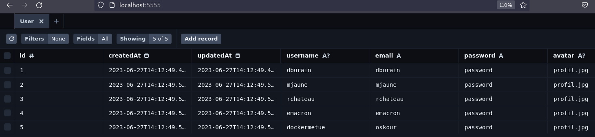

# API

## Swagger
[localhost:4000/api](localhost:4000/api)


**Required decorator:**
Nestjs/swagger decorator to display the routes
```
@ApiTags('Users') 
export class userController { ... }
```


## Prisma Studio
[localhost:5555](localhost:5555)

Allow to visualize and interact with the database content.


